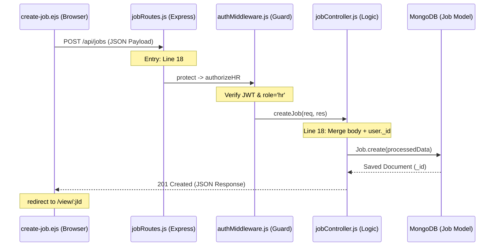

# HR Flow 1: Post Job (Ultra-Granular)

This document tracks the journey of a "Job Posting" from the moment the HR user opens the form to the final database confirmation.

---

### Step 1: Open Job Form
- **Frontend Action**: HR clicks "Create Job" button.
- **View Rendered**: [create-job.ejs](file:///home/alisha.shaik/Desktop/projects/jobs/JodsScreening/frontend/views/create-job.ejs)
- **Controller Source**: `jobController.renderCreateJob` (Line 1167).

### Step 2: Form Completion & Submission
- **Trigger**: HR clicks "Create Job & Build Assessment" button (Line 422).
- **JavaScript Handler**: `create-job.ejs` Line 5514.
- **Payload (`req.body`)**:
  ```json
  {
    "title": "Node.js Developer",
    "department": "Engineering",
    "description": "Full JD text...",
    "questionsPerSkill": 3,
    "allowAIGeneration": true,
    "notificationSettings": { "sendInApp": true, "sendEmail": false }
  }
  ```
- **XHR Phase**: The browser sends an AJAX `POST` request to `/api/jobs`.

### Step 3: Global Routing & Security
- **Entry Point**: [app.js](file:///home/alisha.shaik/Desktop/projects/jobs/JodsScreening/backend/app.js) Line 68: `app.use('/api/jobs', jobRoutes)`.
- **Router Entry**: [jobRoutes.js](file:///home/alisha.shaik/Desktop/projects/jobs/JodsScreening/backend/routes/jobRoutes.js) Line 18: `router.post('/', jobController.createJob)`.
- **RBAC Gatekeeper**:
  1. `protect`: [authMiddleware.js](file:///home/alisha.shaik/Desktop/projects/jobs/JodsScreening/backend/middleware/authMiddleware.js) Line 17 (Verifies JWT).
  2. `authorizeHR`: [authMiddleware.js](file:///home/alisha.shaik/Desktop/projects/jobs/JodsScreening/backend/middleware/authMiddleware.js) Line 46 (Verifies `role === 'hr'`).

### Step 4: Controller Processing
- **File**: [jobController.js](file:///home/alisha.shaik/Desktop/projects/jobs/JodsScreening/backend/controllers/jobController.js) Line 18.
- **Data Transformation**: Line 23.
  - Spreading `...req.body`.
  - Setting `postedBy = req.user._id` (linking the job to this specific HR user).
  - Explicitly setting `status = 'active'`.

### Step 5: Database Persistence
- **Model**: `Job.js`
- **Action**: `Job.create()` writes the document to the `jobs` collection.

### Step 6: Audit & Governance
- **Internal Call**: `logAction()` (Line 34).
- **Audit Payload**:
  - `entityType`: "job"
  - `action`: "create"
  - `metadata`: `{ jobTitle: "Node.js Developer" }`

### Step 7: Final Response
- **Response**: `res.status(201).json({ success: true, data: job })`.
- **State Change**: The frontend receives the new `job._id` and then immediately triggers the **Assessment Generation Flow** (Sub-Flow 4).

---

## Visual Technical Flow

