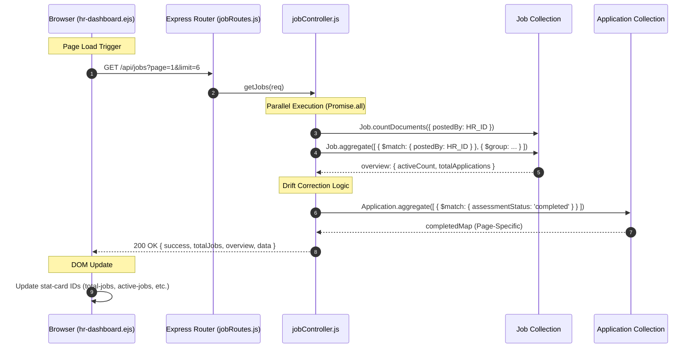

# HR Flow 8: HR Dashboard Global Metrics & Analytics (Ultra-Granular)

This flow explains how the system calculates and renders the high-level metrics seen on the recruiter's primary dashboard.

---

## 1. The Visual Flow: Metric Aggregation

---

## 2. Technical Layer Breakdown

### Layer 1: The Request Handlers
- **View Initializer**: `hr-dashboard.ejs` (Line 256) calls `loadJobs()` on mount.
- **API Point**: `GET /api/jobs` mapped to `jobController.getJobs`.

### Layer 2: The Logic Engine (jobController.js)
- **Identity Context (Line 200)**: 
  `if (req.user.role === 'hr') query.postedBy = req.user._id;`
  This is the security guard ensuring shared databases don't leak stats between recruiters.
- **The "Big Number" Aggregation (Line 211)**:
  Uses `{ $group: { _id: null, activeCount: { $sum: { $cond: [...] } }, totalApplications: { $sum: "$applications" } } }`. 
  This transforms thousands of job records into exactly two numbers in milliseconds.

### Layer 3: The Accuracy Guard (Real-Time Drill Down)
- **The Problem**: Job-level counters (like `job.assessmentsCompleted`) can fall out of sync if there's a database crash mid-write.
- **The Solution (Line 232)**: The controller performs a **Live Count** on the `Application` collection for the jobs currently shown.
- **Metric Merging (Line 240)**: The "drift-proof" count is injected into the job objects before being sent to the frontend.

### Layer 4: The Frontend Render (hr-dashboard.ejs)
- **Data Destructuring (Line 118)**:
  `document.getElementById('total-jobs').textContent = data.totalJobs;`
  The frontend performs a direct mapping from the JSON response to the 4 primary dashboard metrics.

---

## 3. Data Transformation Summary

| Field | Source | Meaning |
| :--- | :--- | :--- |
| `totalJobs` | `Job.countDocuments` | Total job count matching user identity filters. |
| `activeCount` | `Job.aggregate` | Jobs where `status === 'active'`. |
| `totalApplications`| `Job.aggregate` | Sum of all candidates ever applied to the HR's jobs. |
| `completedCount` | `Application.aggregate`| Precise count of candidates who finished the simulation. |
