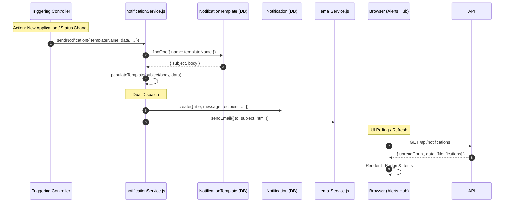

# HR Flow 9: User Notifications & Real-Time Alerts Hub (Ultra-Granular)

This flow explains the logic behind the "Alerts" system that keeps Recruiters informed of candidate progress and notifies Candidates of their status.

---

## 1. The Visual Flow: The Notification Pipeline

---

## 2. Technical Layer Breakdown

### Layer 1: The Multi-Channel Service (notificationService.js)
- **Generic Payload (Line 24)**: The service accepts a normalized object. If a `jobId` is passed, it automatically inherits the job's `notificationSettings` (mute/unmute emails).
- **Template Engine (Line 10)**: Uses a regex-based `populateTemplate` function to perform safe string replacement of placeholders like `{{candidateName}}`.
- **The Enrollment Guard (Line 50)**: A critical hardcoded logic that ensures candidates *always* receive transactional emails (confirmations/invites) even if the recruiter has muted their own global dashboard alerts.

### Layer 2: Persistence & State (Notification.js)
- **Schema Design**: Every alert is a document in the `Notification` collection.
- **Index Optimization**: Fields `recipient` and `createdAt` are indexed to ensure that "Fetch Latest" queries on the dashboard remain instantaneous as the database grows.
- **Action URLs (Line 28)**: Every notification can store a relative `actionUrl` (e.g., `/api/applications/application/:id/view`), allowing the UI to transform a text alert into a clickable deep link.

### Layer 3: The API & UI Sync (notificationController.js)
- **Poll-Ready API (Line 30)**: `getNotifications` returns both the data and an `unreadCount` in one trip, minimizing server round-trips.
- **Atomic Read State (Line 48)**: Marking a notification as read is an atomic `findByIdAndUpdate`, ensuring the dashboard badge updates immediately without full-page reloads.

### Layer 4: The Frontend alerts Hub (hr-dashboard.ejs)
- **Polling Loop (Line 260)**: The dashboard runs `setInterval(loadHRAlerts, 60000)`, ensuring the recruiter stays updated even without refreshing the page.
- **Dynamic CSS (Line 163)**: Items with `isRead: false` are rendered with an `unread` class to visually highlight new events.

---

## 3. Core Notification Triggers in the System

| Event | Source File | Category |
| :--- | :--- | :--- |
| **New Application** | `applicationController.js` | SYSTEM (for Recruiter) |
| **Assessment Invited**| `applicationController.js` | CANDIDATE (for Candidate) |
| **Status Update** | `applicationController.js` | CANDIDATE (for Candidate) |
| **System Maintenance**| `notificationService.js` | SYSTEM (Global) |
