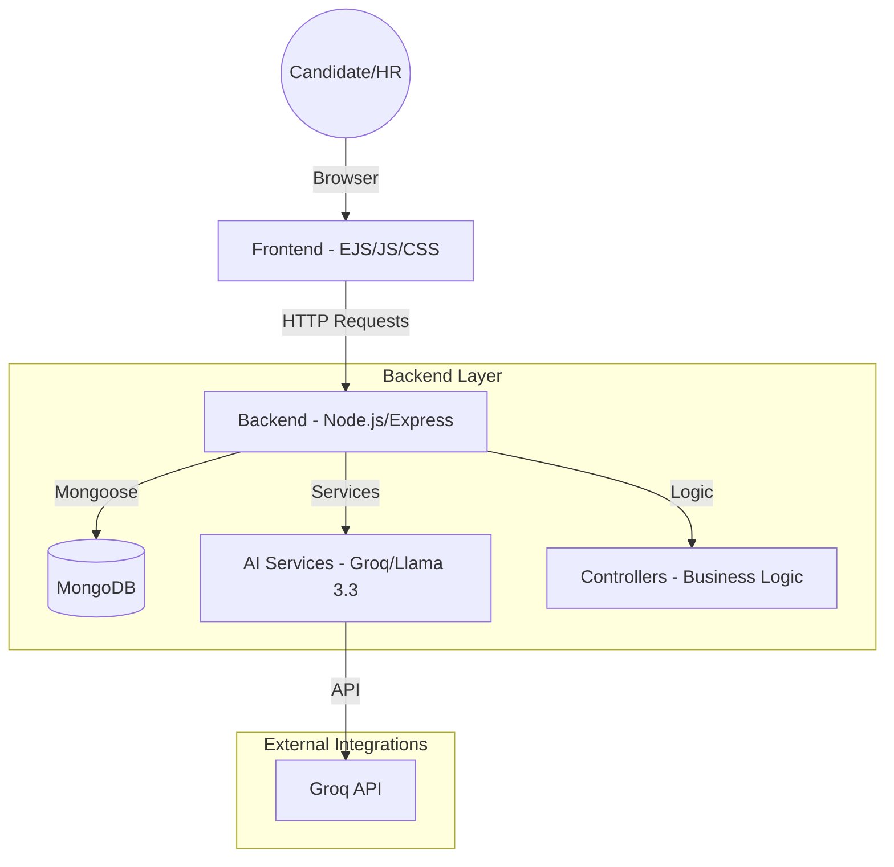

# System Architecture - ScenarioSim 🛡️✨

ScenarioSim is a full-stack AI-driven recruitment platform. It leverages large language models (LLMs) to automate job description analysis, technical question sourcing, and behavioral simulation.

## High-Level Architecture

## Core Components

### 1. Frontend (EJS, Plain JS, Vanilla CSS)
- **Role**: Handles all UI rendering and candidate interactions.
- **Key Pages**:
    - `candidate-dashboard`: Overview of applications.
    - `dojo-assessment`: The dynamic, all-in-one assessment engine (MCQs + AI Simulation).
    - `job-detail`: HR management view for assessments.

### 2. Backend (Node.js & Express)
- **Role**: Orchestrates the data flow, security (JWT), and AI integration.
- **Key Routers**:
    - `/api/auth`: Login, registration, and session management.
    - `/api/assessment`: The consolidated hub for the candidate's journey.
    - `/api/jobs`: Assessment and job management for HR.

### 3. Data Layer (MongoDB & Mongoose)
- **Models**:
    - `User`: Roles (Admin, HR, Candidate) and credentials.
    - `Job`: Position details and link to its assessment.
    - `Assessment`: The "Golden Record" containing technical questions and AI scenario templates.
    - `ChatSession`: The live, stateful record of a candidate's current simulation.

### 4. AI Service Layer (Groq/Llama 3.3)
- **jdParserService**: Analyzes raw JD text to extract skills and timing.
- **assessmentGeneratorService**: Creates specific workplace scenarios based on the JD analysis.
- **aiService**: Acts as the "AI Judge" during simulations, evaluating candidate responses in real-time.

---
🛡️ *ScenarioSim: Transforming Recruitment through Immersive Simulation.* 🛡️
