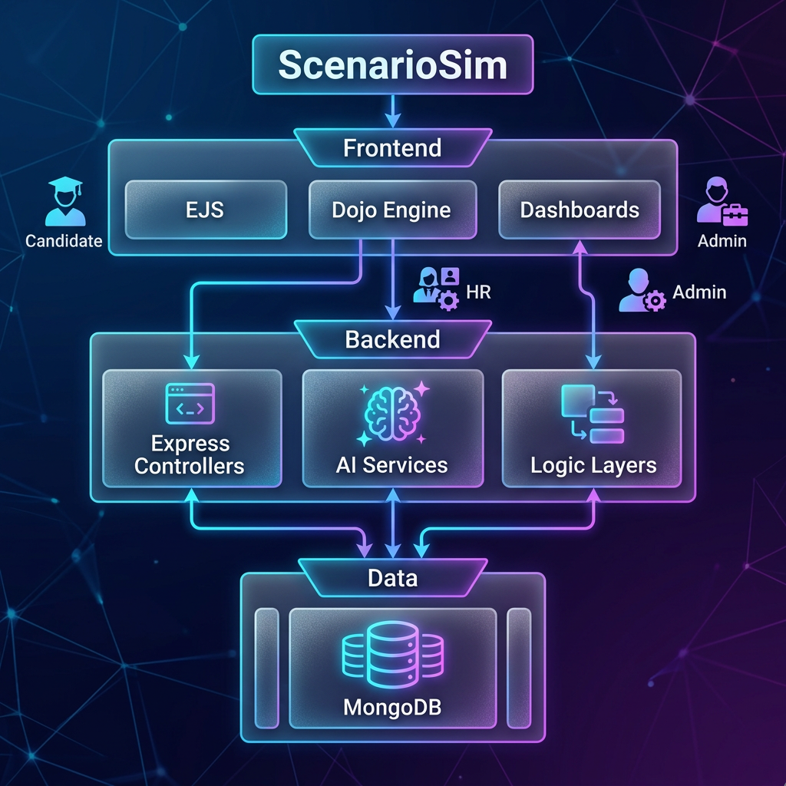
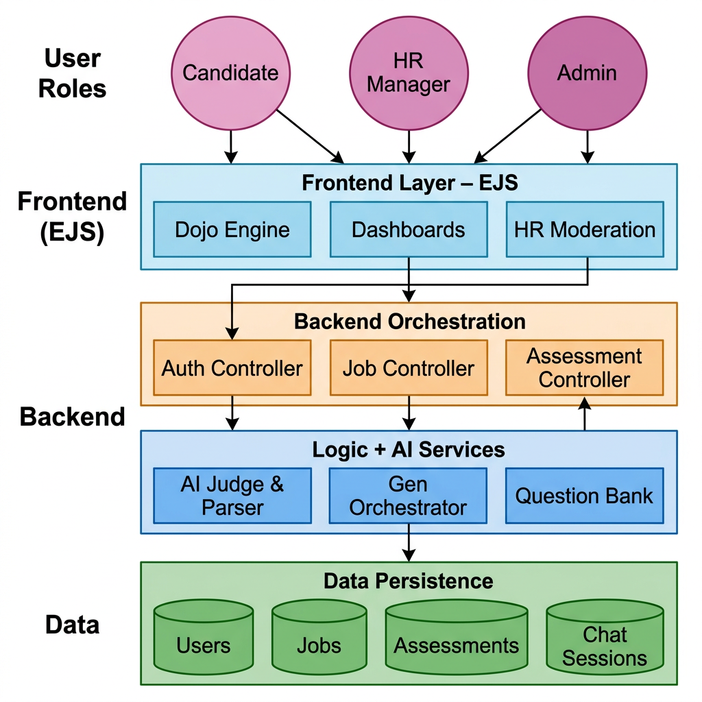
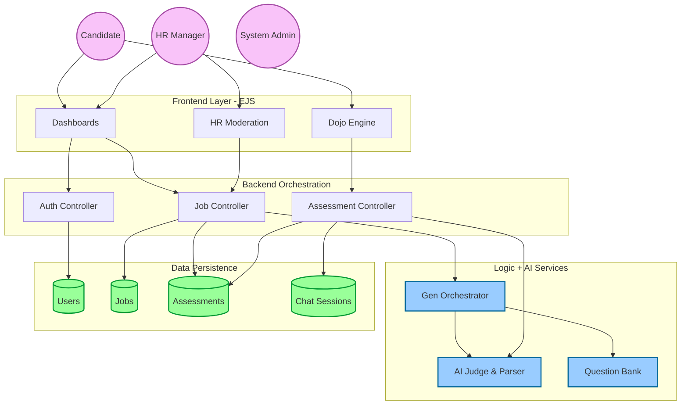

# Master Architecture Map - ScenarioSim 🛡️✨

This is the high-level "Source of Truth" for the entire platform's architecture. 

## 🖼️ High-Fidelity Visual Map

## 🗺️ Detailed Flow Chart

> **ℹ️ Mermaid diagrams:** I've installed the **Markdown Preview Mermaid Support** VS Code extension for you. Press `Ctrl+Shift+V` to reload the preview and the diagrams below will now render with colors.

## 🟢 Live Mermaid Chart (Editable)

> [!TIP]
> **Detailed Data Payload Specs**
> For a granular look at the JSON structures sent between these components, see the **[Data Payload Recipes](file:///home/alisha.shaik/Desktop/projects/jobs/JodsScreening/documentation/system_map/DATA_PAYLOAD_RECIPES.md)**.

## 🛡️ Service Responsibility Layer

### 1. The Gateway (Controllers)
- **Role**: Map HTTP requests to business logic.
- **Key Task**: Session validation and payload sanitization.

### 2. The Engine (Services)
- **Role**: Heavy lifting and external integrations.
- **`jdParserService`**: The portal to Groq/Llama.
- **`questionBankService`**: The curator of technical knowledge.

### 3. The Evidence (Data)
- **Role**: Immutable storage of the candidate's performance.
- **Relational Integrity**: `Application` acts as the pivot table connecting the `User`, `Job`, and `Assessment`.

---
🛡️ *Master Map version 1.0. Generated via Master Architect protocol.* 🛡️
