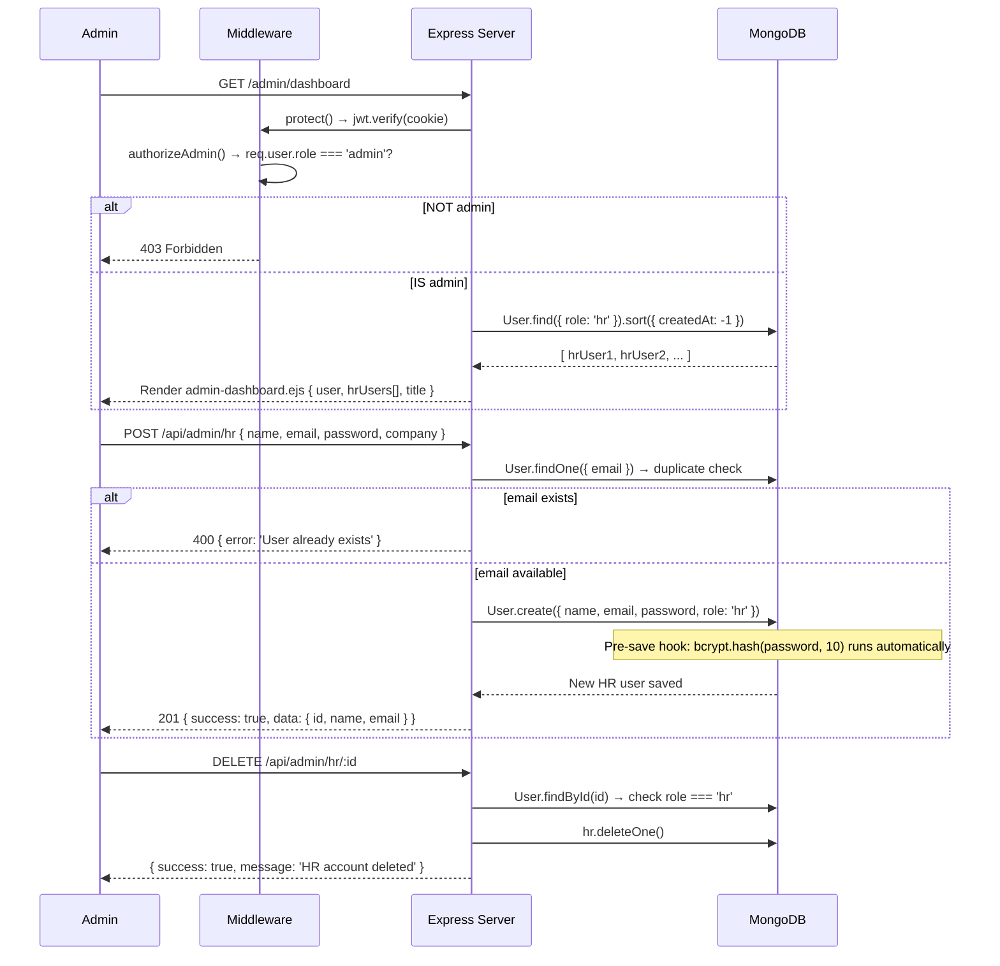

# Feature Flow: Admin HR Management 🛡️

## Admin Dashboard & HR Account Lifecycle



---

## Key Security Rules

| Rule | Implementation |
| :--- | :--- |
| Only `admin` can access these routes | `authorizeAdmin()` middleware blocks all other roles |
| Only `hr` role can be deleted via this endpoint | Controller checks `hr.role !== 'hr'` → returns 400 |
| No cascade delete | HR's jobs remain in DB after deletion (assigned jobs become "orphaned") |
| Self-registration is candidate-only | `authController.register()` forces `role: 'candidate'` regardless of request body |
| Password never stored in plaintext | `User.js` pre-save hook runs `bcrypt.hash()` automatically before every `save()` |

---

## POST Body for Creating HR

```json
{
  "name":       "Sarah HR",
  "email":      "sarah@company.com",
  "password":   "securepassword123",
  "company":    "TechCorp",
  "department": "Engineering"
}
```

**Response:**
```json
{
  "success": true,
  "message": "HR account created successfully",
  "data": {
    "id":    "65e...abc",
    "name":  "Sarah HR",
    "email": "sarah@company.com"
  }
}
```
