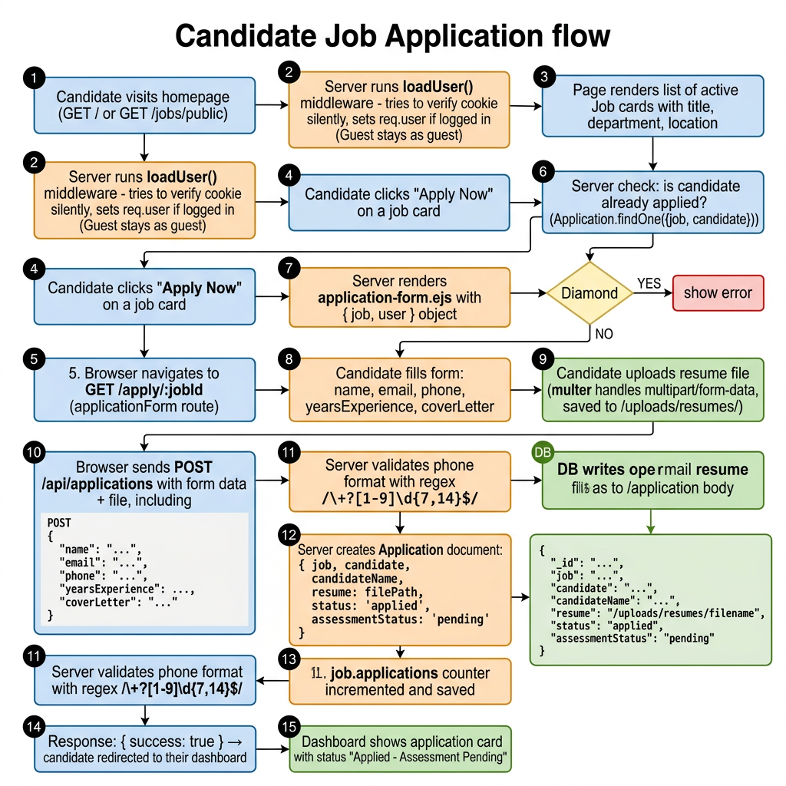

# Feature Flow: Candidate Job Application 🛡️

## Full Application Submission Pipeline



**What this shows:**
- How `loadUser()` silently checks for a cookie — non-blocking (guests see the same page)
- Duplicate application guard: `Application.findOne({ job, candidate })` before showing the form
- How Multer handles the resume file upload and saves it to `/uploads/resumes/filename.pdf`
- Phone validation regex: `/^\+?[1-9]\d{7,14}$/`
- How the `Application` document is created with `status: 'applied'` and `assessmentStatus: 'pending'`
- The `job.applications` counter is incremented separately to avoid full DB queries on the dashboard

---

## POST Body & Created Document

**Request body** sent by the form:
```json
{
  "candidateName":   "Jane Doe",
  "candidateEmail":  "jane@example.com",
  "candidatePhone":  "+919876543210",
  "yearsExperience": 4,
  "coverLetter":     "I am excited to apply..."
}
```
*Resume is sent as `multipart/form-data` (binary file field)*

**Application document** created in MongoDB:
```json
{
  "job":              "<JobId>",
  "candidate":        "<UserId>",
  "candidateName":    "Jane Doe",
  "resume":           "uploads/resumes/resume-1709123456.pdf",
  "status":           "applied",
  "assessmentStatus": "pending",
  "appliedAt":        "2024-02-28T08:00:00Z"
}
```

---

## Unique Index Guard

`Application.js` defines:
```js
ApplicationSchema.index({ job: 1, candidate: 1 }, { unique: true });
```
This means MongoDB itself **rejects duplicate applications** at the DB level — even if the controller check is somehow bypassed.

---

## 📋 Function Chain

| Step | Function | File |
| :--- | :--- | :--- |
| List public jobs | `getPublicJobs()` | `applicationController.js` |
| Open form | `renderApplicationForm()` | N/A (inline route render) |
| Submit application | `submitApplication()` | `applicationController.js` |
| Update HR status | `updateApplicationStatus()` | `applicationController.js` |
