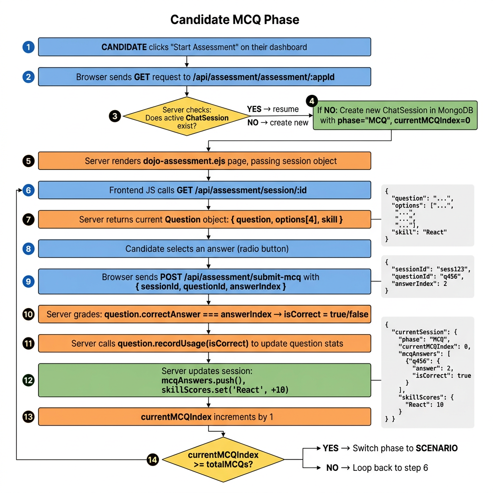
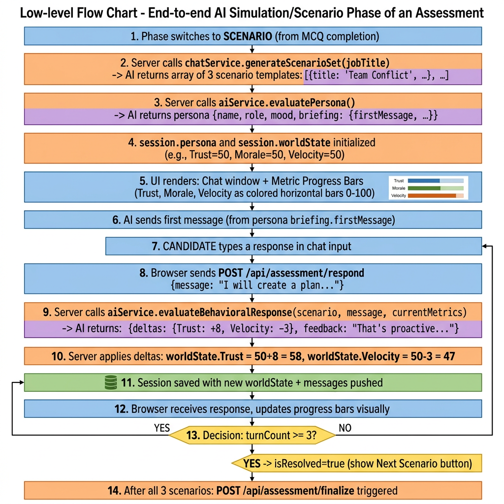
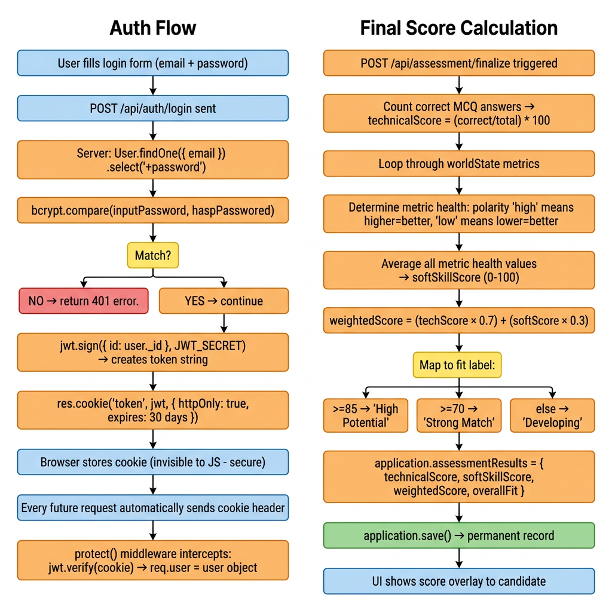

# Feature Flow: Candidate Assessment Journey 🛡️

## Phase 1 — MCQ (Technical Questions)



**What this shows:**
- How the session is created or resumed in MongoDB on page load
- Exact JSON sent when submitting: `{ sessionId, questionId, answerIndex: 2 }`
- How `question.correctAnswer === answerIndex` grades the answer in one line
- How skill scores accumulate: `skillScores.set('React', currentScore + 10)`
- The decision point that flips from `MCQ → SCENARIO` phase

---

## Phase 2 — AI Simulation (Scenario Chat)



**What this shows:**
- How `worldState` is initialized from the Assessment's `simulationConfig.metrics`
- How the candidate's message triggers `evaluateBehavioralResponse()` in `aiService.js`
- Exact AI output: `{ deltas: { Trust: +8, Velocity: -3 }, feedback: "That's proactive..." }`
- How `worldState` is updated: `session.worldState.set('Trust', 58)` and saved
- The UI progress bars update by receiving the new `worldState` map in the JSON response
- Turn limit of 3 responses per scenario before auto-advancing

---

## Phase 3 — Final Score Calculation


*(Right-hand chart — Final Score Calculation)*

**Formula:**
```
technicalScore  = (correctMCQs / totalMCQs) * 100
softSkillScore  = average health of all worldState metrics
weightedScore   = (techScore × 0.7) + (softScore × 0.3)

Fit label:  >= 85 → "High Potential"
            >= 70 → "Strong Match"
            >= 55 → "Potential Fit"
            below → "Developing"
```

Stored in: `application.assessmentResults = { technicalScore, softSkillScore, weightedScore, overallFit }`

---

## 📋 Function Chain

| Step | Function | File |
| :--- | :--- | :--- |
| Start / Resume | `startAssessment()` | `assessmentController.js` |
| Load Current Q | `getAssessmentSession()` | `assessmentController.js` |
| Submit MCQ | `submitMCQAnswer()` | `assessmentController.js` |
| Respond to AI | `respondToScenario()` | `assessmentController.js` |
| AI Evaluate | `evaluateBehavioralResponse()` | `aiService.js` |
| Next Scenario | `nextScenario()` | `assessmentController.js` |
| Calculate Score | `finalizeAssessment()` | `assessmentController.js` |
