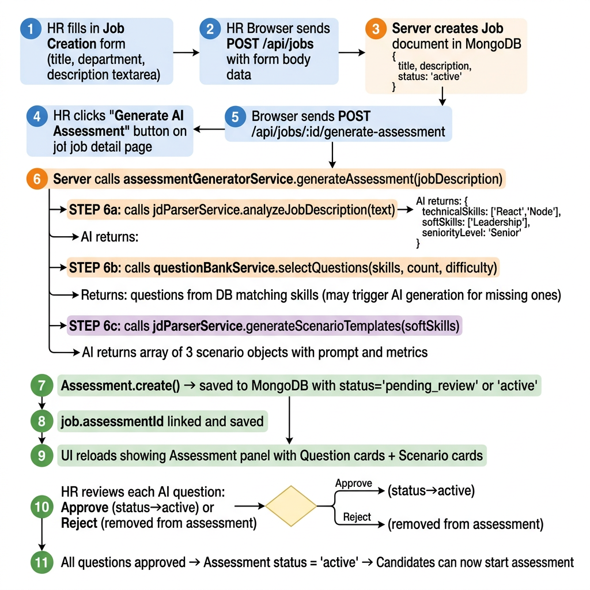

# Feature Flow: HR Job & Assessment Creation 🛡️

## Full Pipeline: Job Description → Active Assessment



**What this shows:**
- Step-by-step from HR typing a Job Description to an assessment being live for candidates
- The 3-part AI analysis pipeline inside `assessmentGeneratorService`
- How missing skills trigger AI question generation (vs. pulling from existing bank)
- The Moderation gate: AI-generated questions start as `pending_review`, HR must approve them
- Only when ALL questions are `active` does the Assessment status flip to `active`

---

## AI Sub-Pipeline Inside Step 6

```
assessmentGeneratorService.generateAssessment(jdText, jobId, userId, config)
  │
  ├─ [6a] jdParserService.analyzeJobDescription(text)
  │         LLM returns ──► { technicalSkills: ['React', 'Node.js'],
  │                           softSkills: ['Leadership', 'Conflict Resolution'],
  │                           seniorityLevel: 'Senior',
  │                           technicalWeight: 0.7, softSkillWeight: 0.3 }
  │
  ├─ [6b] questionBankService.selectQuestions(skills, countConfig, difficulty, allowAI)
  │         DB lookup ──► Questions matching each skill
  │         If skill missing ──► aiService.generateTechnicalQuestions(skill, difficulty)
  │         Returns: { questions: [...], missingSkills: ['GraphQL'] }
  │
  └─ [6c] jdParserService.generateScenarioTemplates(softSkills, roleCategory, count)
            LLM returns ──► [ { softSkill: 'Leadership', prompt: '...', metrics: ['Trust','Morale'],
                                 stakeholder: 'CEO', theme: 'Budget Crisis' } ]
```

---

## Regeneration Flows

| Action | Endpoint | Logic |
| :--- | :--- | :--- |
| Regenerate all questions | `POST /api/jobs/:id/regenerate-questions` | Keeps manual questions, replaces AI ones |
| Regenerate all scenarios | `POST /api/jobs/:id/regenerate-scenarios` | Keeps manual scenarios, replaces AI ones |
| Regenerate ONE scenario | `POST /api/jobs/:id/scenario/:scenarioId/regenerate` | Replaces only that index in the array |
| Delete ONE scenario | `DELETE /api/jobs/:id/scenario/:scenarioId` | Splices from array, updates `questionCounts` |

---

## Question Moderation Lifecycle

```
AI generates question
       │
       ▼
Question.status = 'pending_review'
Assessment.status = 'pending_review'   ← candidates cannot start yet
       │
   HR reviews
    ┌──┴──┐
  Approve  Reject
    │         │
    ▼         ▼
status=     Removed from
'active'    assessment array
            Question.status='retired'
       │
       ▼
All questions active?
  YES → Assessment.status = 'active'  ← candidates can now start
```
