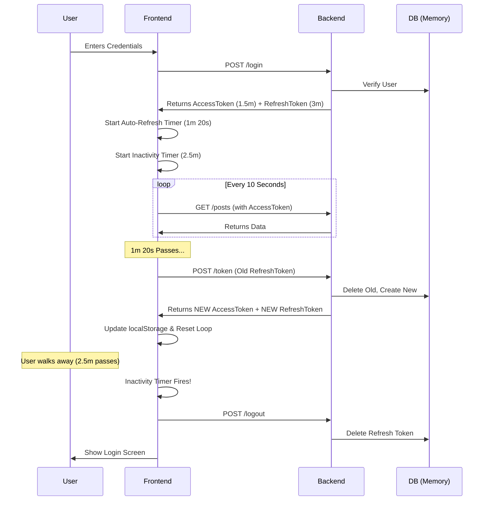

# Lesson 7, 8, & 9: The Full JWT System Explained

You now have a **Professional-Grade Authentication System**.
It combines **MVC Architecture**, **JWT Security**, and **Smart Frontend Logic**.

Here is exactly how it works, step-by-step.

## 1. The Architecture (Backend)
We organized our code into **MVC** so it scales.

*   **`server.js`**: The Entry Point. Loads middleware (CORS, JSON) and routes.
*   **`models/data.js`**: The "Database". Stores Users and Refresh Tokens in memory.
*   **`controllers/userController.js`**: The Brains. Handles Login, Signup, Refresh logic.
*   **`middleware/authMiddleware.js`**: The Bouncer. Protects routes by checking the Access Token.
*   **`routes/`**: The Map. Tells the server which URL goes to which Controller function.

## 2. The Life of a User Session (The Workflow)

### Phase 1: Login (Getting the Tickets)
1.  **User** sends `POST /login` with username/password.
2.  **Controller** verifies credentials.
3.  **Controller** generates TWO tokens:
    *   **Access Token (1.5m)**: Short-lived. Use this to get data.
    *   **Refresh Token (3m)**: Long-lived. Use this to get new Access Tokens.
4.  **Frontend** saves both in `localStorage`.

### Phase 2: Accessing Data (Using the Ticket)
1.  **Frontend** wants to get Posts (`GET /posts`).
2.  **Frontend** attaches `Authorization: Bearer <AccessToken>`.
3.  **Middleware** checks the token:
    *   **Valid**: Request goes through. "Here are your posts".
    *   **Expired**: Middleware says "403 Forbidden".

### Phase 3: The Auto-Refresh Loop (Keeping the Session Alive)
This is the magic part in `script.js`.
1.  **Frontend** knows the Access Token expires in 1.5 minutes.
2.  **Frontend** sets a timer for **1 minute 20 seconds**.
3.  **Timer Fires**: Frontend silently calls `POST /token` with the **Refresh Token**.
4.  **Backend Logic (Rotation)**:
    *   Checks if Refresh Token is valid.
    *   **Deletes** the old Refresh Token (Security!).
    *   **Creates** a NEW Access Token + NEW Refresh Token.
5.  **Frontend** saves the new tokens. The user never notices!

### Phase 4: Inactivity Logout (The Security Guard)
1.  **Frontend** listens for mouse/keyboard movement.
2.  **Every Movement**: Resets a 2.5-minute timer.
3.  **No Movement?**: Timer hits zero.
    *   **Frontend**: Calls `logout()`.
    *   **Backend**: Deletes the Refresh Token.
    *   **UI**: Redirects to Login screen.

## 3. Visual Diagram

## 4. Key Takeaways
*   **Rotation**: We change the Refresh Token every time used. If a hacker steals one, they can only use it once (or until you use it).
*   **Silent Refresh**: User experience is smooth. No "Session Expired" popups while they are working.
*   **Safety**: If they leave the computer unlocked, the Inactivity Timer saves them.
